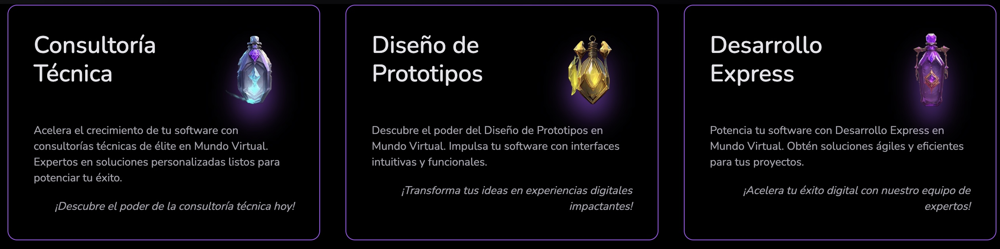

 

• [About Me](#my-digital-space) • [Can I Help You?](#how-can-i-help-you) • [Favorite Technologies](#favorite-technologies) •

## 🐺 A.K.A. Wolfcito

### Mirrors
#### Centraliced
- <a href="https://wolfcito.xyz" target="_blank">https://wolfcito.xyz</a>
#### Decentraliced
- <a href="https://wolfcito.on-fleek.app" target="_blank">https://wolfcito.on-fleek.app</a>

#### Light readings
- Hashnode: <a href="https://hashnode.com/@wolfcito" target="_blank">Wolfcito's Hashnode</a>
- Paragraph: <a href="https://paragraph.xyz/@road-blockchain" target="_blank">Wolfcito's Paragraph</a>

 

## My Digital Space

Hi everyone! 🐺 I'm Luis Fernando, also known as Wolfcito, from the vibrant landscapes of Ecuador. As an experienced Software Development Architect, I specialize in crafting solutions from concept to production. My passions include Web 3.0, Blockchain, and Fullstack development. Currently, I'm exploring Ethereum EVM, Layer 2 solutions like Optimism, and opportunities within the Mode Network. I'm also a Tech-cooperator at 🟡 Mode Network and an 💜 Ambassador for Push Protocol. 🚀

Join me on this blog for an exciting journey through tech challenges, continuous learning, and evolving technology landscapes. Beyond coding, I love traveling, trying diverse cuisines, and experiencing new cultures.

Let's explore the digital world together, where tech insights, travel tales, and cultural discoveries meet! 🗺️

A guiding phrase for me is "Senri no michi mo, ippou kara," meaning "A journey of a thousand miles begins with the first step."

I focus on web programming to enhance user experiences. My goal is to create value in every project and leave the world better than I found it.

- 💼 Need any freelance work? Feel free to reach out to me via [email](mailto:guffenix+github@gmail.com)
- 💬 If you need help with anything, I'll be more than happy to assist you!

## How Can I Help You?

## Favorite Technologies

<a href="https://wolfcito.xyz/projects" target="_blank">You can review more of My Personal Projects</a>
 

I enjoy staying informed and broadening my knowledge regularly. If you appreciate any of my projects or wish to support my efforts, feel free to treat me to a coffee.

Thank you very much for your support! 💚
 

 

