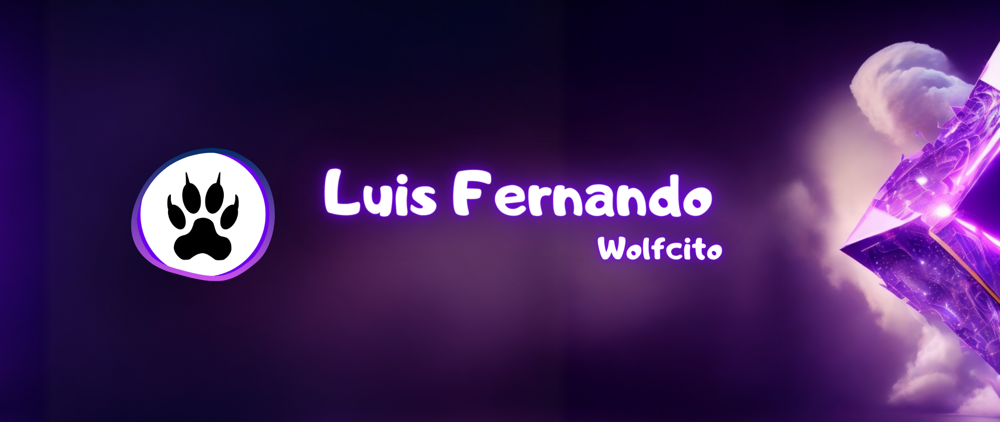

  

•
[About me](#about) •
[Favorite Technologies](#favorite-technologies) •
[Can I help you?](#can-i-help-you) •

## Wolfcito on MundoVirtual Solutions

Blog: <a href="https://wolfcito.mundovirtual.solutions" target="_blank">https://wolfcito.mundovirtual.solutions</a> \
IPFS: <a href="https://fancy-voice-3770.on.fleek.co" target="_blank">https://fancy-voice-3770.on.fleek.co</a> 

## About

Hello! I'm Luis Fernando from Ecuador. Currently, I work as a Software Developer Architect. I'm passionate about the Web3 world, Blockchain, and Fullstack development on Ethereum. I love taking on challenges, constantly learning, traveling, indulging in culinary delights, and immersing myself in new cultures.\
\
The phrase that reflects my focus in this stage of my life is "Senri no michi mo, ippou kara," which means "A journey of a thousand miles begins with the first step" 🐺.\
\
I have specialized in web programming with the aim of enhancing user experience. I have an interest in mobile app development. My commitment starts with myself and extends to the world. I strive to create value in the projects I participate in, with the ultimate goal of leaving the world a better place than I found it.

- 💼 Need any freelance work? Feel free to reach out to me at [email](mailto:guffenix@gmail.com) :D
- 💬 If you need help with anything, I'll be more than happy to assist you!

## How can I help you?

## Favorite technologies

You can check some project [HERE!](https://wolfcito.mundovirtual.solutions/projects/)
\
\

I like to keep myself updated and expand my knowledge every day. If you like any of my projects, or if you want to support my work, consider inviting me for a coffee. I really apreciate any contribution to this space 😃
\
\
Thank you very much for your support! 💚
 

 

